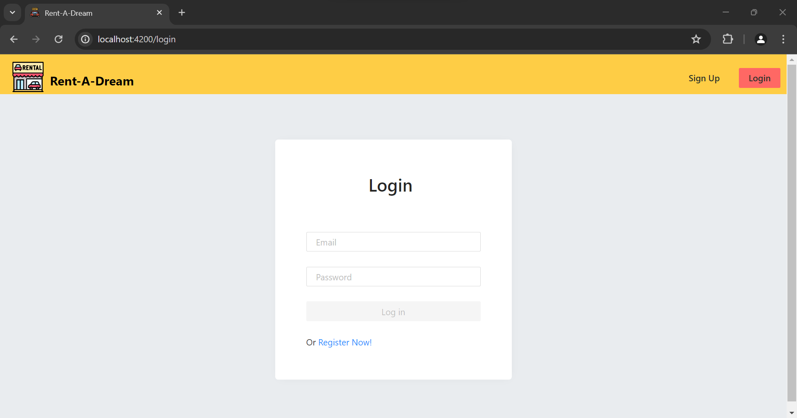
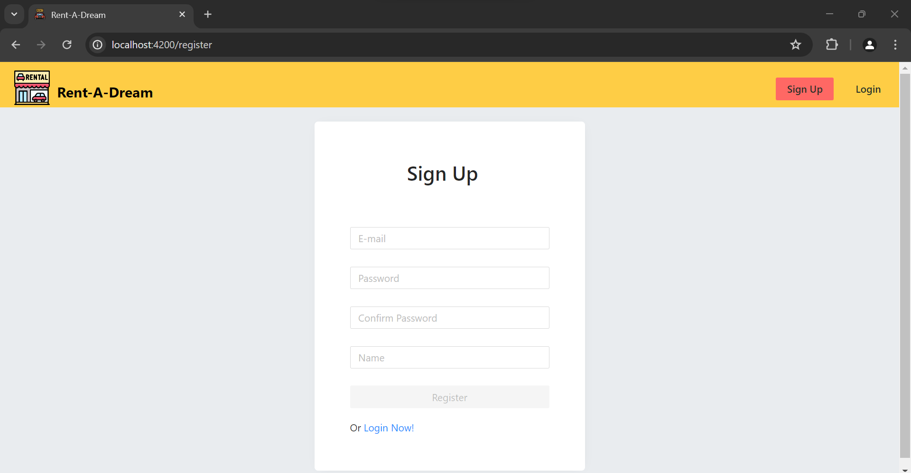
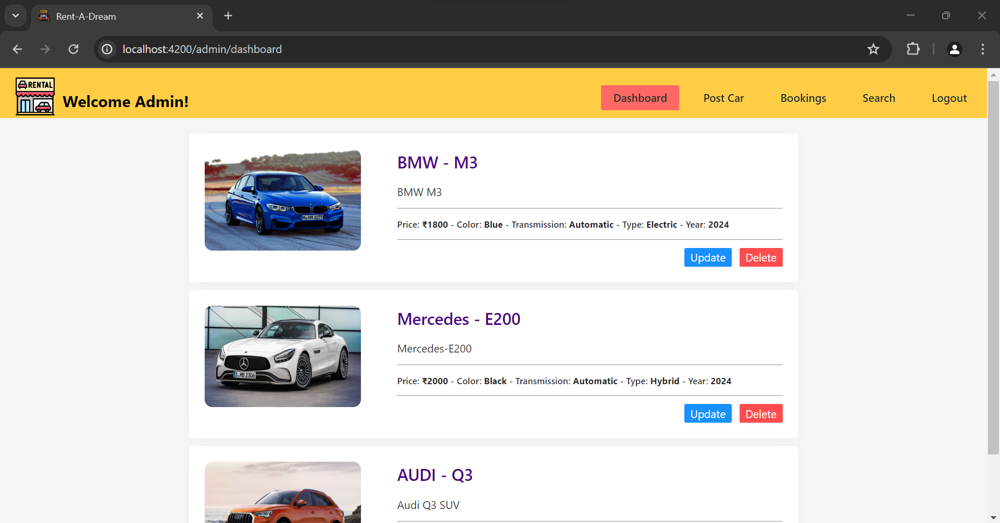
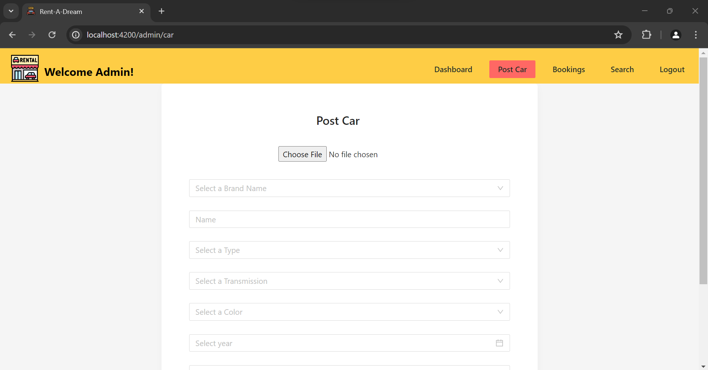
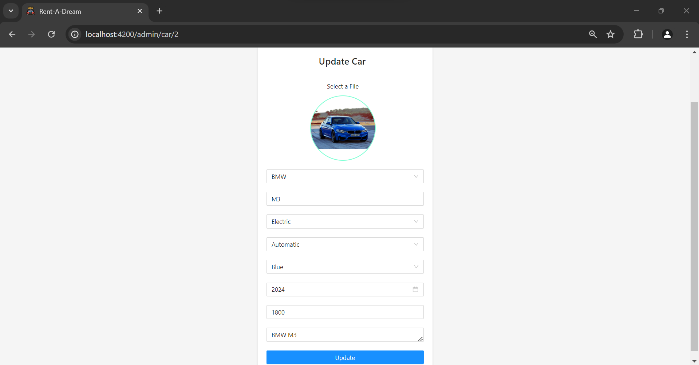
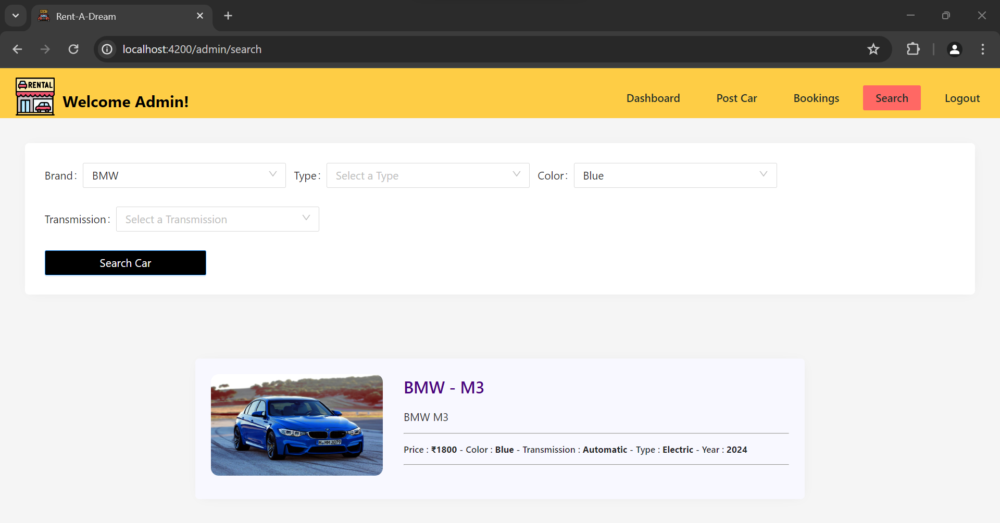
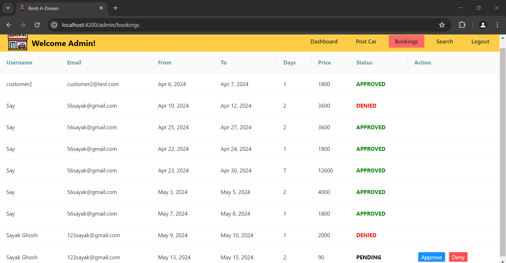
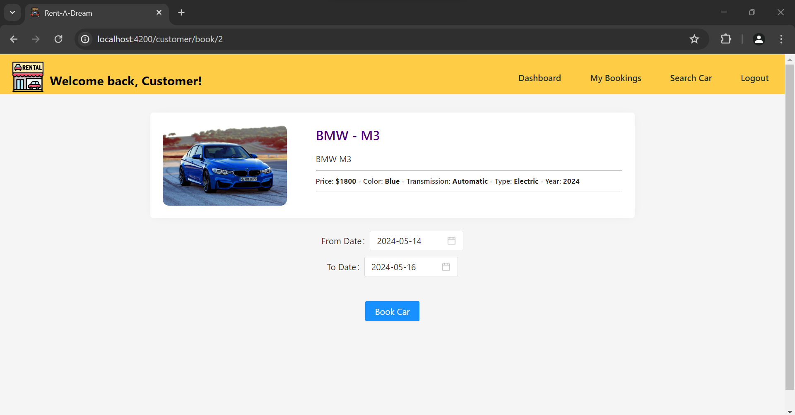

# Developer - Sayak Ghosh

<h1>Task</h1>

> Car Rental Application  
> Website - [Book-A-Dream](https://webdesigner-netizen.github.io/payment-gateway-integration/ "Saved Dreams Charity")

<h2>Table of Contents</h2>

* Customer Signup
* Admin | Customer Login

<h4>Customer Features</h4>

* Customer Dashboard with listings fo all the cars
* Book a car
* Bookings History
* Search Functionality
* Logout

<h4>Admin Features</h4>

* Admin Dashboard with listings fo all the cars
* Post new car 
* Update car details
* Delete car entry
* Bookings history of all users
* Functionality to approve or deny customer booking request
* Search functionality
* Logout

<h2>About</h2>

> Created a Full Stack Car Rental System that uses Spring Boot for the backend and Angular for the frontend.   -Utilized Ng-Zorro, a UI library for Angular to style various components of the frontend, including Navbars, buttons, forms, etc.   -Utilized MySql Workbench to manage the databases for users, cars, and booking requests for cars.   -Customers can signup, login, search for type of cars they would like to book and make booking requests to be either approved or denied by the admin.   -Admins can post new cars to the site that users can view and book, approve or deny booking requests made by customers, search for existing cars in the system, update information for existing cars in the system and delete existing cars in the system.   -Improvements will be added as soon as they are completed.

<h2>Images</h2>

<h2>Languages Used</h2>

* HTML5
* CSS3
* Javascript
* jQuery

<h2>Status</h2>

> Project - Complete
